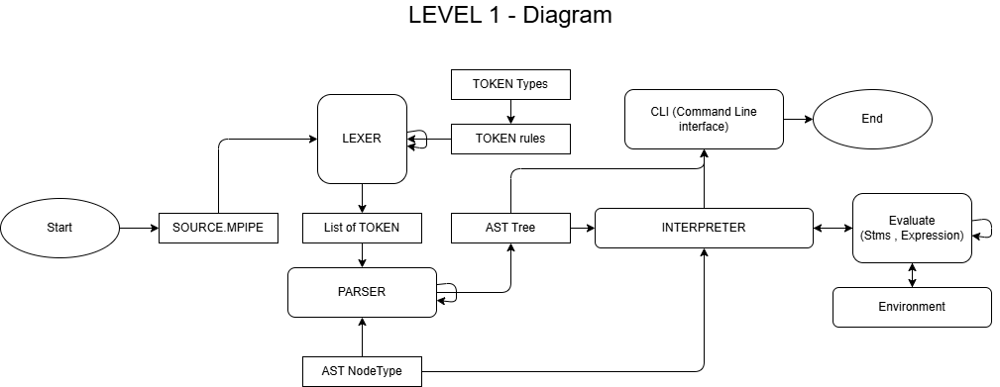

# Java Custom Interpreter: PIPE Language

## Getting Started
<p>The **PIPE meme language**, a practice programming language interpreter using java
This project made for final project on Programming Languages.</p>

### Reserved Keywords
**Variable Decleration**
- `let` -> `tap`
- `const` -> `sealed`

**Control Structure**
- `if` -> `pipe`
- `elif` -> `branch`
- `else` -> `drain`

**CLI (Command Line I/O)**
- `cout` -> `flow`

**Repetition**
- `while` -> `cycle`
- `break` -> `clog` 
- `continue` -> `flush` 

**Function**
- `def` -> `faucet` 
- `return` -> `spill` 

**Reserved Word**
- `true` 
- `false` 
- `null` 
- `and`
- `or`
---

### Interpreter Diagram



### Compile
To make changes edit `source.mpipe`
```bash
faucet loop_test()
{
    sealed test = 1;
    tap step = 0;
    cycle(step < 5)
    {
        step = step + 1;  // you can only add number this way
        pipe(step == 2)
        {
            flush;
        }
        branch(step == 4){
            clog;
        }
        flow("Interation" , step);
    }
}
faucet else_if_return_test(x, y) 
{
    pipe(x > y) 
    {
        spill x - y;
    } 
    branch (x == y) 
    { 
        spill x * y;
    } 
    drain 
    {
        spill;
    }
}
flow();
loop_test() // when calling faucet function no semi colon
flow(else_if_return_test(5,5));
```

Compile all Java files into the `out` folder:
```bash
javac -d out *.java
```
### Run
To run the interpreter from `out` folder:
```bash
java -cp out Main
```